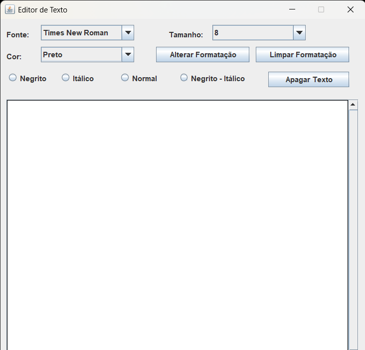

# Editor de Texto com Formatação

Este projeto é uma aplicação Java que simula um pequeno editor de texto com funcionalidades de formatação de fonte, cor, estilo e tamanho. 
Foi desenvolvido como parte de uma atividade da disciplina **POO 2 (Programação Orientada a Objetos II)**.

## ✨ Funcionalidades

- **Seleção de Fonte:** 10 opções de fontes disponíveis em um `ComboBox`.
- **Tamanho da Fonte:** 10 tamanhos distintos.
- **Cor do Texto:** Escolha entre 10 cores diferentes.
- **Estilos de Texto:** Negrito, itálico e combinações.
- **JTextArea com:**
  - Suporte a quebra de linha automática.
  - Barra de rolagem.

## 🧰 Botões Disponíveis

- **Alterar Formatação:** Aplica a fonte, tamanho, cor e estilo selecionados ao texto do `JTextArea`.
- **Limpar Formatação:** Restaura a formatação original.
- **Apagar Texto:** Limpa todo o conteúdo do `JTextArea`.

## License

Este projeto está licenciado sob a licença MIT - consulte o arquivo ['LICENSE'](LICENSE) para mais detalhes.
